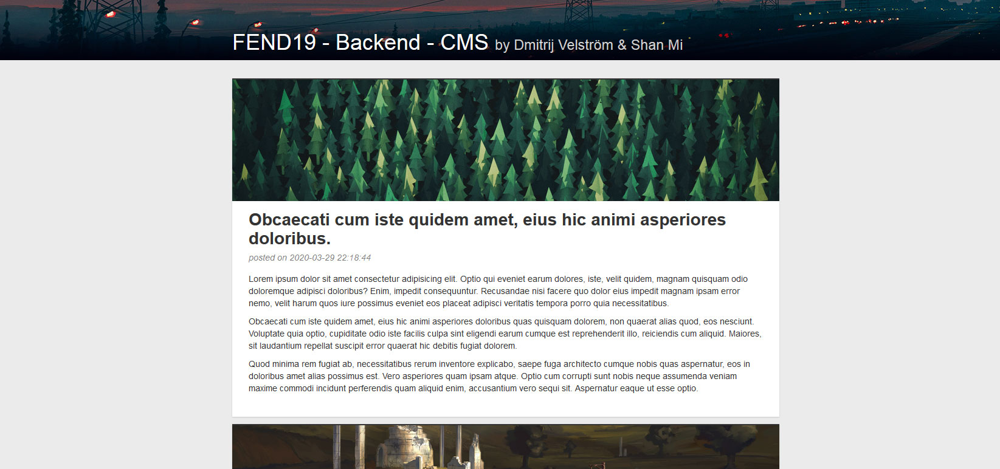
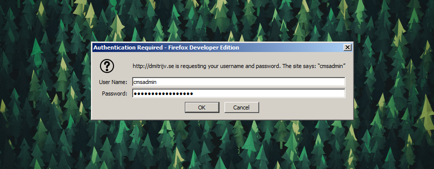
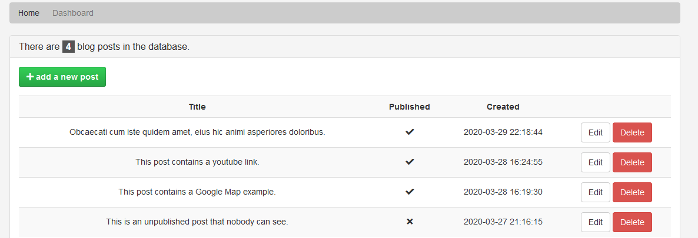

# FEND19 - Backend – Project: Content Management System



## Description

The purpose of this project is to develop a simple CMS application that lets you create, read, update and delete blog posts. The system is written in PHP, JavaScript and uses a MySQL database to persist data. The work was performed in a group of two students.

## Implementation

Functions that create, manipulate and help display blog data are collected in CMS class.

```html
<section id="main">
  <div class="container">
    <section class="post-list">
      <?php CMS::getPublishedBlogPostsHtml(); ?>
    </section>
  </div>
</section>
```

Running SQL queueres on the database is done with the help of DB class that follows the Singleton pattern. A single PDO connection is created and used through the system to avoid opening and closing new connections unnecessarily.

For example, to get the number of blog posts in the database you can simply run:

```php
  return DB::run("SELECT count(*) FROM post")->fetchColumn();
```

User input is collected using HTML forms POST request to php routines that trigger appropriate calls in the CMS class. Input data is validated on both Frontend and Backend layers.

```html
<input type="file" name="attatched_image" id="post-attatched_image" accept=".jpg,.jpeg,.png,.gif" required />
```

```php
function isAttatchedImageValid($target_file) {
  // check if format is allowed
  $allowedExtentions = ["gif", "jpeg", "jpg", "png"];
  $imageFileType = strtolower(pathinfo($target_file, PATHINFO_EXTENSION));
  if(!in_array($imageFileType, $allowedExtentions)) {
```

If input validation fails on the Frontend layer then data can not be submitted at all. If user somehow manages to avoid performing Frontend validation input data will fail on the Backend and user will be redirected to an error page.

### Administrator Area

Blog managment is done with Administrator tool which is located in the "admin" subfolder which is protected by a Directory Access lock (grade requirement).



Once correct credetial are entered user gets access to the Administrator panel from which you can see a list of all blog posts stored in the database.



### Creating new posts

```php
  $newBlogPost = [];
  $newBlogPost['date_created'] = date("Y-m-d H:i:s", time());
  // ...
  // build the rest of the blog post
  // ...
  CMS::createBlogPost($newBlogPost);
  header("Location: ../index.php");
  die;
```

Post body text is converted from plain text to simple HTML by

```php
public static function formStringToParagraphHtml($string) {
    function wrapLineInParagraph($html, $line)  {
      if ($line == "") return $html;
      return $html .= "<p>".$line."</p>";
    }
    $lines = explode("\r\n", $string);
    return array_reduce($lines, "wrapLineInParagraph", "");
}
```

```php
public static function fromParagraphHtmlToString($html) {
  $dom = str_get_html($html);
  $str = "";
  foreach($dom->find('p') as $p) { $str .= $p->innertext . "\n\r"; }
  return $str;
}
```

### Updating posts

Once a post has been created it's possible to edit every part of it from the administrator panel.

### Deleting posts

Each Delete button triggers a javascript function that sends an asynchronous request to a php routine. By this way blog posts can be deleted from the admin page without having to reload it.

```js
deleteBlogPost: function(event) {
  if (confirm("Are you sure?")) {
    const button = event.target.elements.delete;
    const postId = button.dataset.postId;
    const xmlhttp = new XMLHttpRequest();
    xmlhttp.onreadystatechange = function() {
      if (this.readyState == 4 && this.status == 200) {
        // update post counter
        let oldCount = Number(document.querySelector(`span.total-post-count`).textContent);
        document.querySelector(`span.total-post-count`).textContent = oldCount - 1;
        // remove deleted row
        document.querySelector(`tr[data-post-id="${postId}"]`).remove();
      }
    };
    xmlhttp.open("POST", "php-routines/deleteBlogPost.php?postId=" + postId, true);
    xmlhttp.send();
  }
  event.preventDefault();
}
```
